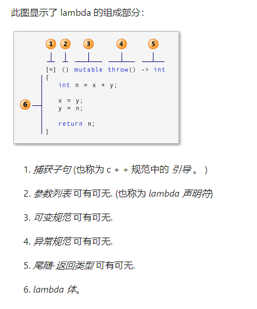
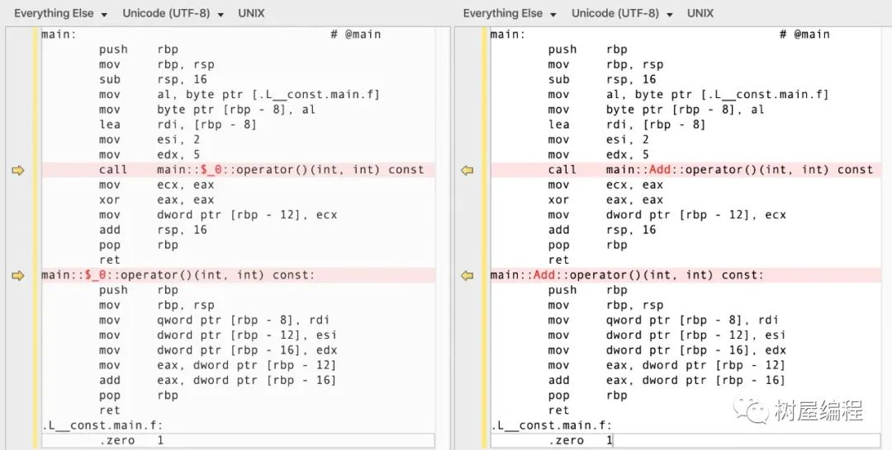

> - ref: [C++中的Lambda表达式Microsoft Docs](https://docs.microsoft.com/zh-cn/cpp/cpp/lambda-expressions-in-cpp?view=msvc-160&viewFallbackFrom=vs-2019)

> - ref:

# lambda 概览

先看一张来自msdn的说明，我认为很清晰。



# cpp lambda的详细介绍和使用

C++11中的Lambda表达式用于定义并创建匿名的函数对象，以简化编程工作。
首先看一下Lambda表达式的基本构成：

```cpp
[capture](parameters) mutable  throw() -> return_type

{

// statement

}
```

```cpp
[函数对象参数](操作符重载函数参数)mutable ->返回值{函数体} // 这里的表述不太对。函数对象参数叫捕获更好点
```

1. 函数对象参数；

`[]` 标识一个Lambda的开始，这部分必须存在，不能省略。函数对象参数是传递给编译器自动生成的函数对象类的构造函数的。函数对象参数只能使用那些到定义Lambda为止时Lambda所在作用范围内可见的局部变量（包括Lambda所在类的this）。函数对象参数有以下形式：

* 空。没有使用任何函数对象参数。
* =。函数体内可以使用Lambda所在作用范围内所有可见的局部变量（**包括Lambda所在类的this**），并且是值传递方式（相当于编译器自动为我们按值传递了所有局部变量）。
* &。函数体内可以使用Lambda所在作用范围内所有可见的局部变量（包括Lambda所在类的this），并且是引用传递方式（相当于编译器自动为我们按引用传递了所有局部变量）。
* 也就 `=` 和 `&` 这两个常用  最推荐 `=`
* this。函数体内可以使用Lambda所在类中的成员变量。
* a。将a按值进行传递。按值进行传递时，函数体内不能修改传递进来的a的拷贝，因为默认情况下函数是const的。要修改传递进来的a的拷贝，可以添加mutable修饰符。
* &a。将a按引用进行传递。
* a, &b。将a按值进行传递，b按引用进行传递。
* =，&a, &b。除a和b按引用进行传递外，其他参数都按值进行传递。
* &, a, b。除a和b按值进行传递外，其他参数都按引用进行传递。

2. 操作符重载函数参数；
   标识重载的 `()` 操作符的参数，没有参数时，这部分可以省略。参数可以通过按值（如：`(a,b))` 和按引用（如：`(&a,&b))` 两种方式进行传递。
3. 可修改标示符；
   mutable声明，这部分可以省略。按值传递函数对象参数时，加上mutable修饰符后，可以修改按值传递进来的拷贝（注意是能修改拷贝，而不是值本身）。

```cpp
// 看一个qt代码的演示demo
QPushButton * myBtn = new QPushButton(this);
QPushButton * myBtn2 = new QPushButton(this);
myBtn2->move(100,100);
int m = 10;
connect(myBtn,&QPushButton::clicked, this, [m] () mutable { m = 100 + 10; qDebug() << m; });
connect(myBtn2,&QPushButton::clicked, this, [=] ()  { qDebug() << m; });
qDebug() << m;
```

4. 函数返回值
   `-> return type`，标识函数返回值的类型，当返回值为void，或者函数体中只有一处return的地方（此时编译器可以自动推断出返回值类型）时，这部分可以省略。
5. 函数体
   `{}` 标识函数的实现，这部分不能省略，但函数体可以为空。

## lambda的调用

我们说lambda是函数对象， 那么它的调用和函数一样。使用函数调用运算符 `()` 来调用。

- 无参数 `mylambda();`
- 有参数 `mylambda(var1, var2);`

```cpp
// 直接定义并调用
int ret = []() -> int {return 20;} ();

// 定义后调用
auto mylambda = [](){return 20};
int ret_value = mylambda();

// 定义有参数的lambda
auto sumLambda = [](int a, int b) ->int {return a + b;};
int sum_ret = sumLambda(2, 3);
```

# [原理] 理解lambda

> 学习自树屋编程 可惜大佬的公众号注销了。 这里整理以前学习的笔记。 感恩

## 概要

编译器到底是如何实现lambda函数的？本文通过介绍一些强大的工具，庖丁解牛，直接看到它的真容，从此彻底掌握lambda。

要了解lambda，先回顾一下函数对象(Function Objects)。要回顾函数对象，先回顾C++运算符重载。

## C++运算符重载

直接说重点：C++运算符重载，本质上等于定义一个成员函数(实际上也可能是全局函数，这个细节对本文不重要)。例如a+b，本质上等同于调用函数「a.operator+(b)」，该函数的名字叫「operator+」。

```cpp
struct Int {
    int value;
    // 重载加号运算符，本质上等于定义了
    // 一个名字叫「operator+」的函数。
    Int operator+(Int i)
    {
        return { value + i.value };
    }
};

int main() {
    Int a{ 3 };
    Int b{ 4 };
    // 调用+运算符，下面两行代码的用法完全等效
    //Int c = a + b;
    Int c = a.operator+(b);
}
```

**对于重载了小括号运算符的类，它的实例就叫做函数对象**。举例：

```cpp
int main() {
  // 在C++中，类可以定义在一个函数的内部。
  // 此处定义在main函数内部。
  struct Add {
    // 重载了括号运算符，
    // 等同于定义了一个名字叫「operator()」的函数
    int operator()(int a, int b) { return a + b; }
  };

  // Add重载了括号运算符，它的实例就是「函数对象」
  Add add;
  // add是一个函数对象，可以像函数一样被调用。
  // 下面两行代码的效果完全相同
  // int v = add(3, 5);
  int v = add.operator()(3, 5);
}
```

**综上，「函数对象」是一个对象，这个对象对应的类重载了括号运算符。**

## lambda函数

根据上面的知识回顾可知，「lambda函数」是一个对象。因为它可以像函数一样被调用，类不能被调用，只有对象才可以。

更准确地说，「lambda函数」就是一个「函数对象」。

lambda的语法其实一个语法糖，编译器会将它“翻译”成一个函数对象，然后再编译。

如何证明呢？用什么工具可以看到？C++的领域有着数量最多水平最高的大师群体，为C++的背书有着压倒性的优势。大师们在工具的开发方面也有很高的造诣。下面我介绍几个，刚好是本文的lambda可以用到的。

## 通过「C++ Insights」来看lambda的本质

C ++ Insights是基于clang的工具，将C++代码转化为「编译器看见的代码」，用它可以看到lambda被编译“翻译”过后的样子。

打开网站 https://cppinsights.io/ 将下面的lambda代码输入到左边的输入框：

```cpp
int main(){
    auto f = [](int a, int b) { return a + b; };
    int i = f(2, 5);
    // printf("%d\n", i);
    // retutn 0;
}
```

点击左上角的“运行”按钮, 右边的输入框得到了lambda“翻译”过后的代码，如下

```cpp
int main()
{
  
  class __lambda_2_14
  {
    public: 
    inline /*constexpr */ int operator()(int a, int b) const
    {
      return a + b;
    }
  
    using retType_2_14 = int (*)(int, int);
    inline constexpr operator retType_2_14 () const noexcept
    {
      return __invoke;
    };
  
    private: 
    static inline /*constexpr */ int __invoke(int a, int b)
    {
      return __lambda_2_14{}.operator()(a, b);
    }
  
  
  };
  
  __lambda_2_14 f = __lambda_2_14{};
  int i = f.operator()(2, 5);
  return 0;
}

```

这个工具将lambda被翻译之后的代码清楚地呈现出来了，代码 `auto f = [](int a, int b) { return a + b; };` 被定义成一个名字叫 `__lambda_2_14`的类，这个类重载了 `operator()`，然后f被定义成这个类的一个实例，通过代码 `__lambda_2_14 f = __lambda_2_14{};` ，最后通过 `f.operator()(2, 5); `进行调用。

可见，lambda函数f就是一个函数对象。你还可以试试其它的lambda，比如说捕获参数的，我这里就不再罗列了。

在本例中，这个类的名字叫 `__lambda_2_14`，其实C++标准并没有规定这个类的命名规则，因为它的名字根本不重要，只要保持唯一即可。所以每个编译器生成的名字都可能是完全不同的。如果你硬要想知道你的编译器给它取得名字是什么，直接用typeinfo就可以，我在后面再介绍。

## 通过「godbolt.org」来看lambda的本质

godbolt是一个在线的编译器，它支持gcc/clang/msvc的不同版本。它可以很方便地看到C++代码生成的汇编代码。

新版网站不需要下面这么麻烦了。 直接打开网站，填代码就行了

```
打开 https://godbolt.org/ 该页面上所有的窗口都关掉
1. 然后点击左上角的Add菜单的“Source Editor”
2. 然后在新打开的窗口上选择“Add new”/"Compiler" 选择编译器和语法标准， 建议学习时候选择clang
至此以后，只要在左边的输入框输入代码，只要代码能编译通过，右边就会出现它的汇编。我们还是把下面的代码输入进去：
```

**填写代码**

```cpp
int main(){
    auto f = [](int a, int b) { return a + b; };
    int i = f(2, 5);
}
```

**右侧显示**:

```
main:                                   # @main
        push    rbp
        mov     rbp, rsp
        sub     rsp, 16
        lea     rdi, [rbp - 8]
        mov     esi, 2
        mov     edx, 5
        call    main::$_0::operator()(int, int) const
        mov     dword ptr [rbp - 12], eax
        xor     eax, eax
        add     rsp, 16
        pop     rbp
        ret
main::$_0::operator()(int, int) const:                   # @"main::$_0::operator()(int, int) const"
        push    rbp
        mov     rbp, rsp
        mov     qword ptr [rbp - 8], rdi
        mov     dword ptr [rbp - 12], esi
        mov     dword ptr [rbp - 16], edx
        mov     eax, dword ptr [rbp - 12]
        add     eax, dword ptr [rbp - 16]
        pop     rbp
        ret
```

通过右边的汇编可以看到，lambda其实是被实现成了一个名字叫 `main::$_0::operator()(int, int) const` 的成员函数。

> 如果对汇编还不熟悉的人怎么办呢？通过两份汇编的对比。

我们先把当前的汇编代码保存下来，然后修改刚才的lambda的代码：

```cpp
int main(){
    struct Add {
        int operator()(int a, int b)const{
            return a + b;
            }
    };

    auto f = Add{};
    int i = f(2, 5);
}
```

现在我们再将此时的汇编代码和之前的对比，如下（左边是lambda、右边是自己定义的函数对象：



可见，除了生成的类的名字不同，一个叫 `Add` 一个叫 `main::$_0` ，（其实这个名字完全不重要），其它的都一模一样。可以得出结论，lambda就是如假包换的函数对象，和自己手动写的函数对象完全一样。

**心得**

你可能觉得godbolt不如前面的cppinsights那么强大。对于本例来说可能如此，但是它显示的汇编在很多时候都有妙用。
比如说分析性能，对于汇编不熟没关系，只要懂得对比就行。两种方案，谁生成的汇编比另外一个多出几行，那它的性能就更低。这个方法帮我自己解决了很多疑惑。

## lambda对应的类的名字

前面提到了，C++标准没有规定每个lambda对应的类的命名规则，编译器只要生成一个唯一的名字即可。如何查看它的名字呢？C++提供了typeinfo类，可以做这样的事情：

```cpp
#include <typeinfo>
#include <iostream>

int main(){
auto f = [](int a, int b) { return a + b; };
int i = f(2, 5);
std::cout<< typeid(f).name() <<"\n";
}

// msvc out: class <lambda_4981dcd116f3521516eb3971d1798aaf>
```

前面的汇编代码给出的名字叫 `main:$_0` ，其实是被 `demangle` 以后的名字。

虽然这个类的名字并不重要，但是在写c++代码的时候，很多时候还是需要得到它的名字，因为有些时候要用类名而不是对象名。这个时候，需要用decltype来获取它的真实名字。例如想用一个lambda作为排序比较来定义一个set：

```cpp
// todo: msvc 编译不过
#include <set>
int main() {

    struct Item {
        int a;
        int b;
    };

    auto cmp = [](const Item& lhs, const Item& rhs) {
        return lhs.a > rhs.a;
    };

    std::set<Item, decltype(cmp)> s; // 第二个模板参数不能直接用cmp，因为cmp是对象
}

```

# [原理] C++的lambda是函数还是对象？

> 学习链接: https://mp.weixin.qq.com/s/JGfewyJX3bl67uvRimbZGA
> 虽然和上面的文章以后编译器编译来看的有冲突，但是思想还是不错的。

**下面是原文**

关于C++的lambda是函数还是对象，这其实不是一个一概而论的问题。

**先说结论**：

    对于有捕获的lambda，其等价于对象。
    对于没有任何捕获的lambda，其等价于函数！

首先，很多C++程序员从lambda 用法上反推容易发现是对象，因为lambda可以捕获！这是函数做不到的。的确，比如：

```cpp
int n = 100;
auto foo = [n](int a) {
    return a > n;
};
cout<< foo(99);
```

如果编译器要实现foo，大致类比这种写法(可能真实的实现细节不是这样，但思路类似)∶

```cpp
struct Foo {
    Foo(int i) {n=i;}
    bool operator()(int a) {
        return a > n;
    }
private:
    int n;
};
```

如果是引用方式捕获了变量，那么struct内有一个指针成员持有被引用捕获的变量的地址。

```cpp
set<int> ns = {100, 200, 300};
auto foo = [&ns](int a) {
    return ns.find(a);
};
cout<< foo(99);
```

大致等价于:

```cpp
struct Foo {
    Foo(set<int>* p) {p_ns = p;}
    bool operator()(int a) {
        auto &ns = *p-ns;
        return ns.find(a);
    }
private:
    set<int>* p_ns;
};
...
set<int> ns = {100, 200, 300};
Foo foo(&ns);
cout<< foo(99);
```

然而……这并不是全部!

在没有捕获任何东西的时候，lambda其实是等价于普通的函数的！可以用Linux C中函数 `pthread_create()`来验证！它只能接收一个参数是 `void*`，返回值也是 `void*`的回调函数。

神奇的是，无参的lambda也可以被pthread_create()使用！

```cpp
#include <iostream>
#include <pthread.h>
using namespace std;

struct A {

    void* operator()(void*) {
        cout<<"xxxx"<<endl;
        return nullptr;
    }
};
int main() {

    A a;
    a(NULL);

    pthread_t t;
    //pthread_create(&t, NULL, a, NULL); // 编译失败
    auto cb = [](void*)->void* {
        cout<<"xxxx"<<endl;
        return nullptr;
    };
    pthread_create(&t, NULL, cb, NULL); // 编译通过
    pthread_join(t, NULL);
    return 0;
}
```

上面代码还可以再改一下，让cb去捕获一个变量， 比如：

```cpp
    auto cb = [&](void*)->void* {
        cout<<"xxxx"<<endl;
        return nullptr;
    };
    pthread_create(&t, NULL, cb, NULL);
```

这时，给pthread_create()传入cb同样会编译失败！错误信息：

```shell
cb.cpp: In function ‘int main()’:
cb.cpp:23:30: error: cannot convert ‘main()::<lambda(void*)>’ to ‘void* (*)(void*)’
   23 |     pthread_create(&t, NULL, cb, NULL);
      |                              ^~
      |                              |
      |                              main()::<lambda(void*)>
In file included from /usr/include/x86_64-linux-gnu/c++/9/bits/gthr-default.h:35,
                 from /usr/include/x86_64-linux-gnu/c++/9/bits/gthr.h:148,
                 from /usr/include/c++/9/ext/atomicity.h:35,
                 from /usr/include/c++/9/bits/ios_base.h:39,
                 from /usr/include/c++/9/ios:42,
                 from /usr/include/c++/9/ostream:38,
                 from /usr/include/c++/9/iostream:39,
                 from cb.cpp:1:
/usr/include/pthread.h:200:15: note:   initializing argument 3 of ‘int pthread_create(pthread_t*, const pthread_attr_t*, void* (*)(void*), void*)’
  200 |       void *(*__start_routine) (void *),
      |       ~~~~~~~~^~~~~~~~~~~~~~~~~~~~~~~~~
```

这其实也不难理解，C++在lambda的设计上也贯彻着零开销 `(Zero Overhead）`原则，也就是C++不在性能上干多余的事，显然函数比对象开销更小。所以即使同为lambda，在有无捕获的时候，其底层实现其实是截然不同的！
