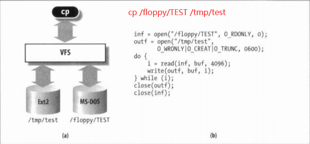
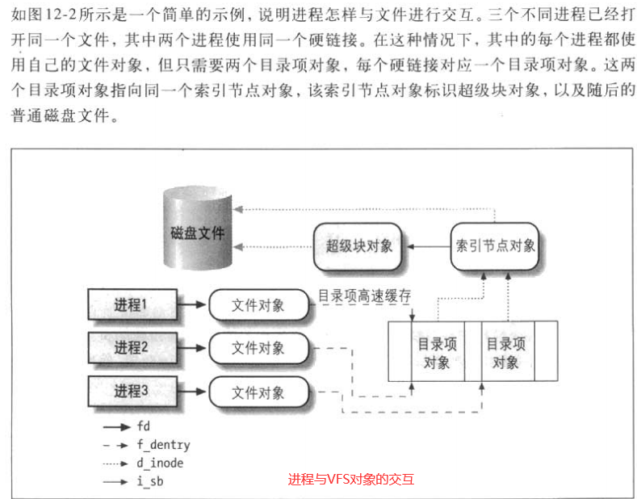

> 本篇笔记是《深入理解Linux内核第三版》第十二章的读书笔记以及参考《Linux内核设计及实现》中的部分内容
>
> https://www.kernel.org/doc/html/latest/filesystems/vfs.html
>
> 本章主要讨论的是VFS的设计目标，结构及其实现。
>
> 讨论五个Unix标准文件类型中的三个文件类型：普通文件，目录文件和符号链接文件。
>
> 设备文件见13章。管道文件见19章。

# 大纲

- VFS是什么
- 虚拟文件系统的作用
- VFS支持的文件系统(三种主要类型)
- VFS的数据结构
- 文件系统的处理
- 路径名的查找
- VFS系统调用的实现
- 文件加锁

# VFS是什么
## VFS简介

VFS: 虚拟文件系统（Virtual Filesystem），也可以称之为虚拟文件系统转换（Virtual Filesystem Switch）是一个内核软件层，用来处理与Unix标准文件系统相关的所有系统调用。其健壮性表现在能为各种文件系统提供一个通用的接口(中间层的思想)。

我们来看一个例子 `cp /floppy/TEST /tmp/test`
`cp` 程序直接和`VFS`交互。`cp`程序并不需要关心操作对象的文件类型，只是通过普通的系统调用。
**VFS是用户的应用程序与文件系统实现之间的抽象层**。(下图的a部分)
如图中的b部分所示：


## VFS支持的文件系统可以划分为三种主要类型

- 硬盘文件系统 (ext系列 UFS NTFS XFS等等)
- 网络文件系统(NFS等)
- 特殊文件系统(/proc文件系统等)

## 通用文件模型

VFS所隐含的主要思想在于引入了一个通用的文件模型（common file model)，这个模型能够表示所有支持的文件系统。该模型严格反映传统Unix文件系统提供的文件模型。这并不奇怪，因为Linux希望以最小的额外开销运行它的本地文件系统。不过，要实现每个具体的文件系统，必须将其物理组织结构转换为虚拟文件系统的通用文件模型。

例如，在通用文件模型中，每个目录被看作一个文件，可以包含若干文件和其他的子目录。但是,存在几个非Unix的基于磁盘的文件系统,它们利用文件分配表(File Allocation Table，FAT)存放每个文件在目录树中的位置，在这些文件系统中，存放的是目录而不是文件。为了符合VFS的通用文件模型，对上述基于FAT的文件系统的实现，Linux必须在必要时能够快速建立对应于目录的文件。这样的文件只作为内核内存的对象而存在。
从本质上说，Linux内核不能对一个特定的函数进行硬编码来执行诸如read()或ioct1()这样的操作,而是对每个操作都必须使用一个指针,指向要访问的具体文件系统的适当函数。

为了进一步说明这一概念，参见VFS简介的图,其中显示了内核如何把read()转换为专对MS-DOS文件系统的一个调用。应用程序对read()的调用引起内核调用相应的sys_read()服务例程，这与其他系统调用完全类似。
我们在本章后面会看到，文件在内核内存中是由一个file数据结构来表示的。这种数据结构中包含一个称为f_op的字段(op是operator的简写)，该字段中包含一个指向专对MS-DOS文件的函数指针，当然还包括读文件的函数(有op的函数指针)。sys_read()查找到指向该函数的指针，并调用它。这样一来，应用程序的read()就被转化为相对间接的调用:
`file->f_op->read(...)`
与之类似，write()操作也会引发一个与输出文件相关的Ext2写函数的执行。**简而言之,内核负责把一组合适的指针分配给与每个打开文件相关的file变量,然后负责调用针对每个具体文件系统的函数（由f_op字段指向)**。

VFS其实采用的是面向对象的设计思路，使用一组数据结构来代表通用文件对象。这些数据结构类似于对象。因为内核纯粹使用C代码实现，没有直接利用面向对象的语言，所以内核中的数据结构都使用C语言的结构体实现，而这些结构体包含数据的同时也包含操作这些数据的函数指针(**数据结构中指向函数的字段就对应于对象的方法**)，其中的操作函数由具体文件系统实现。

**VFS中有四个`主要的`对象类型**，分别是：

- 超级块对象(superblock object)

  它代表一个具体的已安装文件系统。存放已安装文件系统的有关信息。对基于磁盘的文件系统,这类对象通常对应于存放在磁盘上的文件系统控制块(filesystem control block)。

- 索引节点对象(inode object)

  它代表一个具体文件。存放关于具体文件的一般信息。对基于磁盘的文件系统,这类对象通常对应于存放在磁盘上的文件控制块（file control block)。每个索引节点对象都有一个索引节点号,这个节点号唯一地标识文件系统中的文件。

- 目录项对象(dentry object)

  它代表一个目录项，是路径的一个组成部分。存放目录项（也就是文件的特定名称）与对应文件进行链接的有关信息。每个磁盘文件系统都以自己特有的方式将该类信息存在磁盘上。

- 文件对象(file object)

  它代表由进程打开的文件。存放打开文件与进程之间进行交互的有关信息。**这类信息仅当进程访问文件期间存在于内核内存中。**
  
> 注意：因为VFS将目录作为一个文件来处理，所以不存在目录对象。回忆本章前面所提到的目录项代表的是路径中的一个组成部分，它可能包括一个普通文件。换句话说，目录项不同于目录，但目录却是另一种形式的文件，明白了吗?

**每个主要对象中都包含一个操作对象，这些操作对象描述了内核针对主要对象可以使用的方法：**

- `super_operations`对象。其中包括`内核`针对`特定文件系统`所能调用的方法，比如`write_inode()` 和 `sync_fs()` 等方法。
- `inode_operations`对象。 其中包括`内核`针对`特定文件`所能调用的方法， 比如`create()` 和 `link() `等方法。
- `dentry_operations`对象。其中包括`内核`针对`特定目录`所能调用的方法，比如`d_compare()` 和 `d_delete()`
- `file_operations`对象。其中包括`进程`针对`已打开文件`所能调用的方法，比如`read()` 和 `write()`等方法

操作对象作为一个结构体指针来实现，此结构体中包含指向操作其父对象的函数指针(就是很多的函数指针(操作方法)，参数里面使用父对象，比如super_operations)。

```c
// kernel 2.6.34.1
struct super_operations {
   	struct inode *(*alloc_inode)(struct super_block *sb);
	void (*destroy_inode)(struct inode *);

   	void (*dirty_inode) (struct inode *);
	int (*write_inode) (struct inode *, struct writeback_control *wbc);
	void (*drop_inode) (struct inode *);
	void (*delete_inode) (struct inode *);
	void (*put_super) (struct super_block *);
	void (*write_super) (struct super_block *);
	int (*sync_fs)(struct super_block *sb, int wait);
	int (*freeze_fs) (struct super_block *);
	int (*unfreeze_fs) (struct super_block *);
	int (*statfs) (struct dentry *, struct kstatfs *);
	int (*remount_fs) (struct super_block *, int *, char *);
	void (*clear_inode) (struct inode *);
	void (*umount_begin) (struct super_block *);

	int (*show_options)(struct seq_file *, struct vfsmount *);
	int (*show_stats)(struct seq_file *, struct vfsmount *);
#ifdef CONFIG_QUOTA
	ssize_t (*quota_read)(struct super_block *, int, char *, size_t, loff_t);
	ssize_t (*quota_write)(struct super_block *, int, const char *, size_t, loff_t);
#endif
	int (*bdev_try_to_free_page)(struct super_block*, struct page*, gfp_t);
};
```


对于其中许多方法来说，可以继承使用VFS提供的通用函数，如果通用函数提供的基本功能无法满足需要，那么就必须使用实际文件系统的独有方法填充这些函数指针，使其指向文件系统实例。

注意，我们这里所说的对象就是指结构体，而不是像C++或Java那样的真正的对象数据类类型。但是这些结构体的确代表的是一个对象，它含有相关的数据和对这些数据的操作，所以可以说它们就是对象。




VFS除了能为所有文件系统的实现提供一个通用接口外,还具有另一个与系统性能相关的重要作用。最近最常使用的目录项对象被放在所谓目录项高速缓存(dentry cache)的磁盘高速缓存中，以加速从文件路径名到最后一个路径分量的索引节点的转换过程。

一般说来，磁盘高速缓存（disk cache)属于软件机制，它允许内核将原本存在磁盘上的某些信息保存在RAM中，以便对这些数据的进一步访问能快速进行，而不必慢速访问磁盘本身。

**注意，磁盘高速缓存不同于硬件高速缓存或内存高速缓存，后两者都与磁盘或其他设备无关**。硬件高速缓存是一个快速静态RAM，它加快了直接对慢速动态RAM的请求（参见第二章中的“硬件高速缓存”一节)。内存高速缓存是一种软件机制，引入它是为了绕过内核内存分配器（参见第八章中的“slab分配器”一节)。
除了目录项高速缓存和索引结点高速缓存之外，Linux还使用其他磁盘高速缓存。其中最重要的一种就是所谓的页高速缓存，见第十五章。


## VFS所处理的系统调用

下表列出VFS的系统调用，这些系统调用涉及文件系统，普通文件，目录文件以及符号链接文件。

另外还有少数几个由VFS处理的其他系统调用,诸如 `ioprm() ioctl()、pipe()和 mknod()`，涉及设备文件和管道文件，这些将在后续章节中讨论。

最后一组由VFS处理的系统调用，诸如socket ( ) 、 connect()和bind()属于套接字系统调用，并用于实现网络功能。与表12-1列出的系统调用对应的一些内核服务例程，我们会在本章或第十八章中陆续进行讨论。

| 系统调用名                                                   | 说明                            |
| ------------------------------------------------------------ | ------------------------------- |
| mount() umount() umount2()                                   | 安装/卸载文件系统               |
| sysfs()                                                      | 获取文件系统信息                |
| statfs() fstatfs() statfs64() fstatfs64() ustat()            | 获取文件系统统计信息            |
| chroot() pivot_root()                                        | 更改根目录                      |
| chdir()  fchdir() getcwd()                                   | 对当前目录进行操作              |
| mkdir() rmdir()                                              | 创建/删除目录                   |
| getdents() getdents64() readddir() link() unlink() rename() lookup_dcookie() | 对目录项进行操作                |
| readlink() symlink()                                         | 对软链接进行操作                |
| chown() fchown() lchown() chown16() fchown16() lchown16()    | 更改文件所有者                  |
| chmod() fchmod() utime()                                     | 更改文件属性                    |
| stat() fstat() lstat() access() oldstat() oldfstat() oldlstat() stat64() lstat64() fstat64() | 读取文件状态                    |
| open() close()  creat() umask()                              | 打开/关闭/创建/文件mask         |
| dup() dup2() fcntl() fcntl64()                               | 对文件描述符进行操作            |
| select() poll()                                              | 等待一组文件描述符上发生的事件  |
| epoll() (epoll是我加上去的，本书谈论的内核还没有这个)        | I/O event notification facility |
| truncate() ftruncate() truncate64() ftruncate64()            | 更改文件长度                    |
| lseek() _llseek()                                            | 更改文件指针                    |
| read() write() readv() writev()  sendfile() sendfile64() readahead() | 文件I/O操作                     |
| io_setup() io_submit() io_getevents() io_cancle() io_destroy() | 异步I/O（运行多个读和写请求）   |
| pread64() pwirte64()                                         | 搜索并访问文件                  |
| mmap() munmap() mmap2() madvise() mincore() remap_file_pages() | 处理文件内存映射                |
| fdatesync() fsync()  sync() msync()                          | 同步文件数据                    |
| flock()                                                      | 处理文件锁                      |
| setxattr() lsetxattr() fsetxattr() getxattr() lgetxattr() fgetxattr() listxattr() llistxattr() flistxattr() removexattr() lremovexattr() fremovexattr() | 处理文件扩展属性                |

> 注： Linux  2.4 added truncate64() and ftruncate64() system calls that handle large files.  However, these details can be ignored by applications using glibc, whose wrapper  functions  transparently  employ  the more recent system calls where they are available.
>
> 上面表格中这类带64数字之类的可以不用关注。 

前面提到，VFS是应用程序和具体文件系统之间的一层。
不过、在某些情况下，一个文件操作可能由VFS本身去执行，无需调用低层函数。例如，当某个进程关闭一个打开的文件时，并不需要涉及磁盘上的相应文件，因此VFS只需释放对应的文件对象。类似地，当系统调用lseek()修改一个文件指针，而这个文件指针是打开文件与进程交互所涉及的一个属性时，VFS就只需修改对应的文件对象，而不必访问磁盘上的文件，因此，无需调用具体文件系统的函数。从某种意义上说，可以把VFS看成“通用“文件系统,它在必要时依赖某种具体文件系统。


# VFS数据结构

## 超级块对象

各种文件系统都必须实现超级块对象，该对象用于存储特定文件系统的信息，通常对应于存放在磁盘特定扇区中的文件系统超级块或文件系统控制块（所以称为超级块对象)。对于并非基于磁盘的文件系统（如基于内存的文件系统，比如sysfs)，它们会在使用现场创建超级块并将其保存到内存中。

//   base kernel 2.6 （kernel 2.6.34.1）

```c
//定义在 <linux/fs.h>
struct super_block {
	struct list_head	s_list;		/* Keep this first */
	dev_t			s_dev;		/* search index; _not_ kdev_t */
	unsigned char		s_dirt;
	unsigned char		s_blocksize_bits;
	unsigned long		s_blocksize;
	loff_t			s_maxbytes;	/* Max file size */
	struct file_system_type	*s_type;
	const struct super_operations	*s_op;
	const struct dquot_operations	*dq_op;
	const struct quotactl_ops	*s_qcop;
	const struct export_operations *s_export_op;
	unsigned long		s_flags;
	unsigned long		s_magic;
	struct dentry		*s_root;
	struct rw_semaphore	s_umount;
	struct mutex		s_lock;
	int			s_count;
	int			s_need_sync;
	atomic_t		s_active;
#ifdef CONFIG_SECURITY
	void                    *s_security;
#endif
	struct xattr_handler	**s_xattr;

	struct list_head	s_inodes;	/* all inodes */
	struct hlist_head	s_anon;		/* anonymous dentries for (nfs) exporting */
	struct list_head	s_files;
	/* s_dentry_lru and s_nr_dentry_unused are protected by dcache_lock */
	struct list_head	s_dentry_lru;	/* unused dentry lru */
	int			s_nr_dentry_unused;	/* # of dentry on lru */

	struct block_device	*s_bdev;
	struct backing_dev_info *s_bdi;
	struct mtd_info		*s_mtd;
	struct list_head	s_instances;
	struct quota_info	s_dquot;	/* Diskquota specific options */

	int			s_frozen;
	wait_queue_head_t	s_wait_unfrozen;

	char s_id[32];				/* Informational name */

	void 			*s_fs_info;	/* Filesystem private info */
	fmode_t			s_mode;

	/* Granularity of c/m/atime in ns.
	   Cannot be worse than a second */
	u32		   s_time_gran;

	/*
	 * The next field is for VFS *only*. No filesystems have any business
	 * even looking at it. You had been warned.
	 */
	struct mutex s_vfs_rename_mutex;	/* Kludge */

	/*
	 * Filesystem subtype.  If non-empty the filesystem type field
	 * in /proc/mounts will be "type.subtype"
	 */
	char *s_subtype;

	/*
	 * Saved mount options for lazy filesystems using
	 * generic_show_options()
	 */
	char *s_options;
};
```

创建、管理和撤销超级块对象的代码位于文件 `fs/super.c`中。超级块对象通过`alloc_super()`函数创建并初始化。在文件系统安装时，文件系统会调用该函数以便从磁盘读取文件系统超级块，并且将其信息填充到内存中的超级块对象中。

## 超级块操作

**超级块对象中最重要的一个域是s_op，它指向超级块的操作函数表**。超级块操作函数表由super_operations结构体表示，定义在文件<linux/fs.h>中，其形式如下:

```c
struct super_operations {
   	struct inode *(*alloc_inode)(struct super_block *sb);
	void (*destroy_inode)(struct inode *);

   	void (*dirty_inode) (struct inode *);
	int (*write_inode) (struct inode *, struct writeback_control *wbc);
	void (*drop_inode) (struct inode *);
	void (*delete_inode) (struct inode *);
	void (*put_super) (struct super_block *);
	void (*write_super) (struct super_block *);
	int (*sync_fs)(struct super_block *sb, int wait);
	int (*freeze_fs) (struct super_block *);
	int (*unfreeze_fs) (struct super_block *);
	int (*statfs) (struct dentry *, struct kstatfs *);
	int (*remount_fs) (struct super_block *, int *, char *);
	void (*clear_inode) (struct inode *);
	void (*umount_begin) (struct super_block *);

	int (*show_options)(struct seq_file *, struct vfsmount *);
	int (*show_stats)(struct seq_file *, struct vfsmount *);
#ifdef CONFIG_QUOTA
	ssize_t (*quota_read)(struct super_block *, int, char *, size_t, loff_t);
	ssize_t (*quota_write)(struct super_block *, int, const char *, size_t, loff_t);
#endif
	int (*bdev_try_to_free_page)(struct super_block*, struct page*, gfp_t);
};
```

该结构体中的每一项都是一个指向超级块操作函数的指针，超级块操作函数执行文件系统和索引节点的低层操作。

**当文件系统需要对其超级块执行操作时，首先要在超级块对象中寻找需要的操作方法。**

比如：如果一个文件系统要写自己的超级块，需要调用:

```c
sb->s_op->write_super(sb);
```

> 在这个调用中，sb是指向文件系统超级块的指针，沿着该指针进入超级块操作函数表s_op,并从表中取得希望得到的write_super()函数，该函数执行写入超级块的实际操作。**注意**，尽管write_super()方法来自超级块，但是在调用时，还是要把超级块作为参数传递给它，这是因为C语言中缺少对面向对象的支持，而在C++中，使用如下的调用就足够了: `sb.write_super();`
>
> **由于在C语言中无法直接得到操作函数的父对象，所以必须将父对象以参数形式传给操作函数。**

**下面给出super_operations中，超级块操作函数的用法：**

这里可以参考Linux kernel的doc： https://www.kernel.org/doc/html/latest/filesystems/vfs.html#struct-super-operations

| 函数                                                         | 解释                                                         |
| ------------------------------------------------------------ | ------------------------------------------------------------ |
| `struct inode *(*alloc_inode)(struct super_block *sb);`      | 在给定的超级块下创建和初始化一个新的索引节点对象。           |
| `void (*destroy_inode)(struct inode *);`                     | 用于释放给定的索引节点                                       |
| `void (*dirty_inode) (struct inode *);`                      | VFS在索引节点脏（被修改）时会调用此函数。(注1)               |
| `int (*write_inode) (struct inode *, struct writeback_control *wbc);` | 用于将给定的索引节点写人磁盘。（我的源码和书上不完全一样，最新的5.11内核也是这个） |
| `int (*drop_inode) (struct inode *);`                        | 在最后一个指向索引节点的引用被释放后，VFS会调用该函数。注2   |
| `void (*delete_inode) (struct inode *);`                     | 用于从磁盘上删除给定的索引节点。                             |
| `void (*put_super) (struct super_block *);`                  | 在卸载文件系统时由VFS调用，用来释放超级块。调用者必须一直持有s_lock 锁。 |
| `void (*write_super) (struct super_block *);`                | 用给定的超级块更新磁盘上的超级块。注3                        |
| `int (*sync_fs)(struct super_block *sb, int wait);`          | 使文件系统的数据元与磁盘上的文件系统同步。wait参数指定操作是否同步。 |

> 注1：日志文件系统(如ext3，ext4等)执行该函数进行日志更新。
> 注2：VFS只需要简单地删除这个索引节点后，普通Unix文件系统就不会定义这个函数了。
>
> 注3：VFS通过该函数对内存中的超级块和磁盘中的超级块进行同步。调用者必须一直持有s_lock锁。